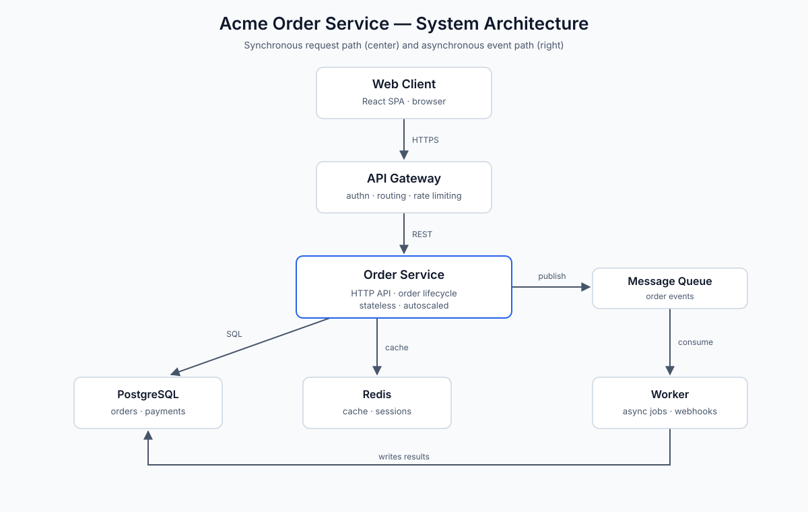
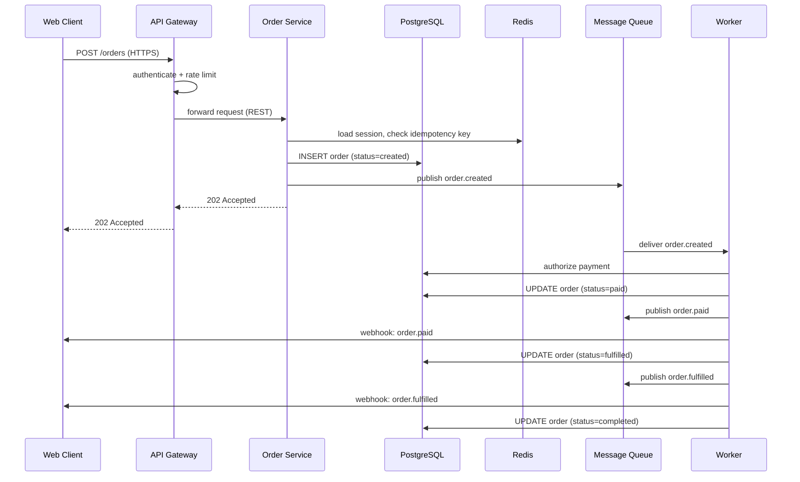

import OrderStateStepper from '../../../../components/OrderStateStepper';

# Acme Order Service — Architecture

**Status:** Approved · **Owner:** Platform Team · **Last reviewed:** 2026-09-01

This document describes the architecture of the Acme Order Service, the
backend system that powers order placement, payment, and fulfillment for
the Acme storefront. It covers the component inventory, the order
lifecycle, the deployment pipeline, and the design decisions behind the
system.

## Overview

The Acme Order Service is a backend service that owns the order lifecycle
for the Acme storefront: creating orders, validating them, capturing
payment, tracking fulfillment, and notifying customers of status changes.
It sits between the customer-facing web client and the data stores, and it
is the single source of truth for order state.

The service is deliberately split into a synchronous request path and an
asynchronous event path. The synchronous path — web client, API gateway,
and the stateless order service — handles the interactive "place an order"
request and returns quickly with an accepted response. The asynchronous
path — message queue and workers — handles everything that does not need
to block the customer: payment authorization, inventory holds, webhooks,
and status updates.

This split keeps the customer-facing path fast and predictable while
allowing the expensive, flaky, or slow work (payment providers,
third-party webhooks) to be retried independently without degrading the
request path. The rest of this document describes each component, the
order lifecycle, the deployment pipeline, and the design decisions behind
these choices.

## System Architecture

The diagram below shows the full system. The synchronous request path runs
down the center (web client → API gateway → order service), and the
asynchronous event path runs along the right side (order service → message
queue → worker).



### Component inventory

| Component     | Technology    | Responsibility                        |
| ------------- | ------------- | ------------------------------------- |
| Web client    | React SPA     | Customer-facing storefront            |
| API gateway   | Envoy         | Auth, routing, rate limiting, TLS     |
| Order service | Go (HTTP)     | Order lifecycle API; persists orders  |
| Message queue | RabbitMQ      | Durable buffer for order events       |
| Worker        | Go (consumer) | Async jobs: payment, webhooks         |
| PostgreSQL    | PostgreSQL 16 | System of record for orders, payments |
| Redis         | Redis 7       | Session store, hot order cache        |

### Component notes

- **Web client.** A React single-page app running in the browser. It is the
  only component that talks to the API gateway directly; all traffic is
  HTTPS.
- **API gateway.** Terminates TLS, authenticates requests, enforces rate
  limits, and routes to the order service. It is intentionally thin: no
  business logic lives here.
- **Order service.** A stateless Go service that owns the order lifecycle.
  It validates incoming orders, persists them to PostgreSQL, and publishes
  lifecycle events to the message queue. Because it is stateless, it scales
  horizontally behind the gateway.
- **Message queue.** A durable queue that decouples the order service from
  the worker. Events survive restarts of either side and are delivered at
  least once.
- **Worker.** Consumes order events and performs the slow work:
  authorizing payment, reserving inventory, and calling customer webhooks.
  Workers are idempotent because queue delivery is at-least-once.[^1]
- **PostgreSQL.** The system of record. Every order state transition is a
  row update, so the database is the source of truth for order status.
- **Redis.** Caches hot order lookups and holds session data. It is
  disposable: losing it degrades performance but never correctness, because
  every cached value can be rebuilt from PostgreSQL.

### Service configuration

The order service is configured through a single YAML file mounted into the
container. The values shown here are representative; real values live in
the secret manager, never in the repository.

```yaml
service:
  name: order-service
  env: production
  replicas: 4
  port: 8080

database:
  host: orders-db.internal
  port: 5432
  database: orders
  pool_size: 20
  statement_timeout_ms: 5000

cache:
  host: orders-cache.internal
  port: 6379
  session_ttl_seconds: 3600
  order_cache_ttl_seconds: 300

queue:
  url: amqp://orders-queue.internal:5672
  exchange: order-events
  prefetch: 10
  retry:
    max_attempts: 5
    backoff_seconds: [1, 5, 30, 120, 600]

webhooks:
  timeout_ms: 3000
  max_retries: 3
```

## Data Flow

### Order lifecycle

An order moves through five states: `created` → `validated` → `paid` →
`fulfilled` → `completed`, with `cancelled` reachable from `created` or
`validated`. The sequence diagram below shows the happy path for placing
and paying an order.

Try the lifecycle interactively (this is a React island embedded in MDX —
the only JavaScript on this page):

<OrderStateStepper client:load />



A few properties follow from this flow:

- The customer gets a `202 Accepted` as soon as the order row is written;
  payment happens out of band.
- Every state transition is persisted to PostgreSQL before the
  corresponding event is published, so the database is never behind the
  queue.
- Webhooks are best-effort notifications; the order state in the database
  is authoritative even if a webhook is lost.

### Failure handling

If the worker fails while processing an event, the event is requeued with
exponential backoff (see the `queue.retry` block above). After the maximum
number of attempts the event is moved to a dead-letter queue and paged to
the on-call engineer. Because workers are idempotent, redelivery is safe.

### Deployment

Every change ships through the same pipeline, shown below. Failures at the
verification stage roll back automatically; there is no manual promotion
step.


The pipeline stages are:

1. **Commit** — a change lands on `main` via a reviewed pull request.
2. **CI** — unit and integration tests run against the change.
3. **Build image** — a container image is built and pushed to the registry.
4. **Deploy staging** — the image is deployed to staging as a 10% canary.
5. **Verify** — smoke checks run against the canary (health endpoints, a
   synthetic order round-trip).
6. **Deploy prod** — on a pass, the image rolls out to production. On a
   fail, the pipeline rolls back to the last good image and retries the
   failed stage after a fix.[^3]

## Design Decisions

### ADR-001: Stateless order service behind a thin gateway

**Context.** The order service handles bursty traffic (sales events,
marketing pushes) and must be able to scale quickly without losing
in-flight requests.

**Decision.** The order service is stateless: all state lives in
PostgreSQL, and session data lives in Redis. The API gateway is kept thin
(authentication, routing, rate limiting only) so that scaling the service
is a matter of adding replicas.

**Consequences.** Scaling is trivial and deploys are rolling, with no
session affinity. The cost is that every request pays a cache or database
round-trip, and the gateway must be highly available because it is a
single entry point.

### ADR-002: Asynchronous event processing for payment and webhooks

**Context.** Payment authorization takes 200 ms to several seconds and can
fail transiently; customer webhooks are third-party endpoints with
unpredictable latency. Doing this work synchronously would make order
placement slow and fragile.

**Decision.** The order service publishes lifecycle events to a durable
message queue, and the worker consumes them to perform payment,
fulfillment, and webhook delivery. The customer-facing request returns
`202 Accepted` as soon as the order is persisted.

**Consequences.** The request path is fast and isolated from third-party
failures, and slow work can be retried independently. The cost is eventual
consistency: there is a short window where the customer has an order that
is not yet paid, and the system must handle at-least-once delivery with
idempotent workers.[^1]

### ADR-003: PostgreSQL as the system of record, Redis as a disposable cache

**Context.** Order state must be durable and queryable, but the read path
(hot order lookups, sessions) is high-volume and latency-sensitive.

**Decision.** PostgreSQL is the single source of truth for orders and
payments. Redis caches hot lookups and holds sessions, but is treated as
disposable: any value in it can be rebuilt from PostgreSQL.

**Consequences.** Correctness never depends on the cache, so a Redis
outage degrades performance but not data integrity. The cost is that cache
misses fall through to PostgreSQL, so the database must be sized for the
worst-case read load.[^2]

## Trade-offs

| Decision          | What we gained             | What we gave up            |
| ----------------- | -------------------------- | -------------------------- |
| Stateless service | Fast deploys, easy scaling | Per-request DB hits        |
| Async events      | Fast 202s, fault isolation | Eventual consistency       |
| Postgres SoR      | Durability, queryability   | DB absorbs cache misses    |
| At-least-once     | No lost events             | Duplicates; idempotency    |
| Auto rollback     | No manual promotion        | Bad canary blocks pipeline |

## Footnotes

[^1]: At-least-once delivery means the worker may process the same event
    twice if it crashes after processing but before acknowledging. Every
    worker therefore checks for an existing result before acting.

[^2]: The cache is sized for the p99 read path, not the worst case; the
    database is sized for the worst case. This keeps Redis small and cheap
    while keeping the system correct under a full cache miss.

[^3]: The deployment pipeline is covered operationally in the
    `deploy-release` SOP, which documents how to override the pipeline when
    it fails.
