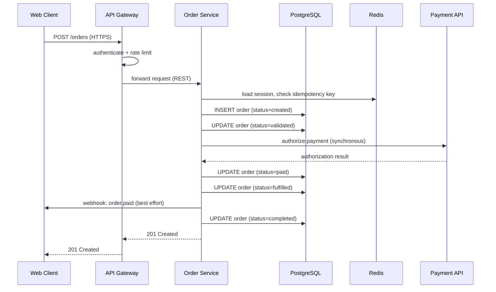

# Acme Order Service — Architecture (v1)

**Status:** Archived · **Owner:** Platform Team · **Last reviewed:** 2025-11-15

> **Archived revision.** This is the `1.0.0` revision of the architecture
> document. It describes the original synchronous design of the Acme Order
> Service, before the asynchronous worker path was introduced. Read the
> **current** version of this document for the architecture that is in
> production today.

This document describes the architecture of the Acme Order Service, the
backend system that powers order placement, payment, and fulfillment for
the Acme storefront. It covers the component inventory, the order
lifecycle, the deployment pipeline, and the design decisions behind the
system.

## Overview

The Acme Order Service is a backend service that owns the order lifecycle
for the Acme storefront: creating orders, validating them, capturing
payment, tracking fulfillment, and notifying customers of status changes.
It sits between the customer-facing web client and the data stores, and it
is the single source of truth for order state.

In this revision the entire order lifecycle runs **synchronously** on the
request path: the order service validates the order, authorizes payment
with the payment provider, and updates fulfillment state all within the
customer's HTTP request. There is no message queue and no separate worker
process.

This design is simple to reason about and to operate, but it couples the
customer-facing request to the latency and reliability of the payment
provider. See the **Supersession notes** at the end of this document for
why the design was revised.

## System Architecture

The diagram below shows the full system. All traffic runs down the center:
web client → API gateway → order service → data stores and the payment
provider.


### Component inventory

| Component     | Technology    | Responsibility                        |
| ------------- | ------------- | ------------------------------------- |
| Web client    | React SPA     | Customer-facing storefront            |
| API gateway   | Envoy         | Auth, routing, rate limiting, TLS     |
| Order service | Go (HTTP)     | Order lifecycle API; persists orders  |
| Payment API   | Stripe        | Synchronous payment authorization     |
| PostgreSQL    | PostgreSQL 16 | System of record for orders, payments |
| Redis         | Redis 7       | Session store, hot order cache        |

### Component notes

- **Web client.** A React single-page app running in the browser. It is the
  only component that talks to the API gateway directly; all traffic is
  HTTPS.
- **API gateway.** Terminates TLS, authenticates requests, enforces rate
  limits, and routes to the order service. It is intentionally thin: no
  business logic lives here.
- **Order service.** A stateless Go service that owns the order lifecycle.
  It validates incoming orders, persists them to PostgreSQL, authorizes
  payment synchronously through the payment API, and publishes customer
  webhooks before responding. Because it is stateless, it scales
  horizontally behind the gateway.
- **Payment API.** The third-party payment provider. Authorization is
  called inline during order placement and takes 200 ms to several
  seconds.
- **PostgreSQL.** The system of record. Every order state transition is a
  row update, so the database is the source of truth for order status.
- **Redis.** Caches hot order lookups and holds session data. It is
  disposable: losing it degrades performance but never correctness, because
  every cached value can be rebuilt from PostgreSQL.

### Service configuration

The order service is configured through a single YAML file mounted into the
container. The values shown here are representative; real values live in
the secret manager, never in the repository.

```yaml
service:
  name: order-service
  env: production
  replicas: 4
  port: 8080

database:
  host: orders-db.internal
  port: 5432
  database: orders
  pool_size: 20
  statement_timeout_ms: 5000

cache:
  host: orders-cache.internal
  port: 6379
  session_ttl_seconds: 3600
  order_cache_ttl_seconds: 300

payment:
  provider: stripe
  timeout_ms: 10000
  retries: 2

webhooks:
  timeout_ms: 3000
  max_retries: 3
```

## Data Flow

### Order lifecycle

An order moves through five states: `created` → `validated` → `paid` →
`fulfilled` → `completed`, with `cancelled` reachable from `created` or
`validated`. The sequence diagram below shows the happy path for placing
and paying an order. Everything happens inside the customer's request.



A few properties follow from this flow:

- The customer waits for the full payment authorization before receiving
  a response; a slow payment provider directly slows order placement.
- Every state transition is persisted to PostgreSQL before the response is
  sent, so the database is always consistent with what the customer was
  told.
- Webhooks are best-effort notifications sent inline; a failing webhook
  endpoint adds latency to every order placement.

### Failure handling

If the payment provider times out, the order service retries the
authorization up to two times within the same request. If the provider is
unavailable, the request fails with a `503` and the order row is left in
`validated` state; the customer retries from the storefront. There is no
background retry mechanism in this revision.

### Deployment

Every change ships through the same pipeline, shown below. Failures at the
verification stage roll back automatically; there is no manual promotion
step.


The pipeline stages are:

1. **Commit** — a change lands on `main` via a reviewed pull request.
2. **CI** — unit and integration tests run against the change.
3. **Build image** — a container image is built and pushed to the registry.
4. **Deploy staging** — the image is deployed to staging as a 10% canary.
5. **Verify** — smoke checks run against the canary (health endpoints, a
   synthetic order round-trip).
6. **Deploy prod** — on a pass, the image rolls out to production. On a
   fail, the pipeline rolls back to the last good image and retries the
   failed stage after a fix.

## Design Decisions

### ADR-001: Stateless order service behind a thin gateway

**Context.** The order service handles bursty traffic (sales events,
marketing pushes) and must be able to scale quickly without losing
in-flight requests.

**Decision.** The order service is stateless: all state lives in
PostgreSQL, and session data lives in Redis. The API gateway is kept thin
(authentication, routing, rate limiting only) so that scaling the service
is a matter of adding replicas.

**Consequences.** Scaling is trivial and deploys are rolling, with no
session affinity. The cost is that every request pays a cache or database
round-trip, and the gateway must be highly available because it is a
single entry point.

### ADR-002: PostgreSQL as the system of record, Redis as a disposable cache

**Context.** Order state must be durable and queryable, but the read path
(hot order lookups, sessions) is high-volume and latency-sensitive.

**Decision.** PostgreSQL is the single source of truth for orders and
payments. Redis caches hot lookups and holds sessions, but is treated as
disposable: any value in it can be rebuilt from PostgreSQL.

**Consequences.** Correctness never depends on the cache, so a Redis
outage degrades performance but not data integrity. The cost is that cache
misses fall through to PostgreSQL, so the database must be sized for the
worst-case read load.

## Trade-offs

| Decision          | What we gained             | What we gave up            |
| ----------------- | -------------------------- | -------------------------- |
| Stateless service | Fast deploys, easy scaling | Per-request DB hits        |
| Sync payment      | Simple, strongly consistent| Customer waits on provider |
| Postgres SoR      | Durability, queryability   | DB absorbs cache misses    |
| Inline webhooks   | No extra infrastructure    | Webhook latency on request |

## Supersession notes

This revision was superseded because the synchronous design showed two
operational problems in production:

1. **Order placement latency tracked the payment provider.** p99 order
   placement time rose to several seconds during payment-provider
   degradation events, and customers abandoned carts.
2. **Webhook failures blocked the request path.** A single slow or failing
   customer webhook endpoint added seconds to every order placement.

The current revision of this document introduces a durable message queue
and an asynchronous worker so that payment authorization, fulfillment, and
webhook delivery happen off the request path.
