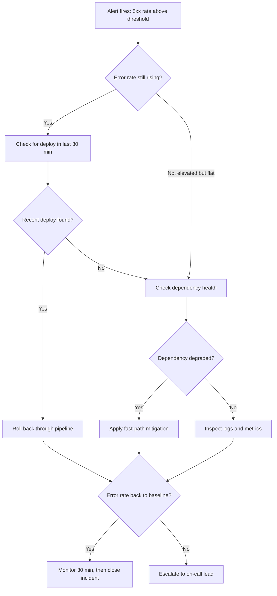

# High Error Rate — Acme Order Service

**Status:** Active · **Owner:** Platform Team · **Last updated:** 2026-09-01

**In this runbook:**

- [Alert description](#alert-description)
- [Severity](#severity)
- [Fast-path mitigation](#fast-path-mitigation)
- [Diagnostics](#diagnostics)
- [Decision flowchart](#decision-flowchart)
- [Escalation](#escalation)

## Alert description

The **high error rate** alert fires when the order service's 5xx rate
exceeds 5% of requests over a 5-minute window. It is visible on the
order service dashboard in the Acme Cloud console and pages the
on-call engineer through PagerDuty (service `acme-order-service`).


*Figure 1: The Acme Cloud monitoring dashboard for the order service.
The `5xx rate` panel (top left) is the panel that fires this alert; the
`queue depth` panel (top right) distinguishes request-path failures
from worker-path failures.*

A sustained 5xx rate means customers are seeing failed order placements
or failed status updates. Treat every firing as a real incident until
diagnostics say otherwise.

## Severity

| Severity | Condition | Response |
| -------- | --------- | -------- |
| SEV-1 | 5xx above 20% for 10 min | Page on-call; open incident in #ops |
| SEV-2 | 5xx above 5% for 10 min | Page on-call; mitigate within the hour |
| SEV-3 | 5xx above 2% sustained | Ticket; fix in business hours |

If customers are seeing failed orders, treat the alert as at least
SEV-2 regardless of the measured rate.

## Fast-path mitigation

Do these first, in order, before deep diagnostics:

1. **Check for a recent deploy.** If a release landed on the order
   service or its worker in the last 30 minutes, roll it back through
   the deployment pipeline (see the `deploy-release` SOP). This is the
   most common cause of this alert.
2. **Pause webhook delivery** if the error spike is on the worker path
   (queue depth rising, request path healthy). Webhook failures retry
   automatically; pausing them stops the retry storm.
3. **Restart order service replicas one at a time** if the database
   pool looks exhausted. A rolling restart resets connection pools
   without dropping capacity.
4. **Scale the worker up** if queue depth is climbing and payment
   authorization is the bottleneck.

## Diagnostics

### Health endpoints

```bash [[2,5]]
# Gateway and order service health checks
curl -sS -o /dev/null -w '%{http_code} gateway\n' \
  https://api.acme.example/healthz
curl -sS -o /dev/null -w '%{http_code} order-service\n' \
  https://order-service.internal.acme.example:8080/healthz
curl -sS https://order-service.internal.acme.example:8080/readyz
```

### Logs

```bash
# Recent errors from the order service (last 15 minutes)
acme-logs query --service order-service --since 15m \
  --filter 'level=error OR status>=500' --limit 50

# Dead-letter queue depth: a rising DLQ means worker failures
acme-queue depth orders-queue.internal order-events.dlq
```

### Metrics

```bash
# 5xx rate, last hour
acme-metrics query --since 1h \
  'rate(http_requests_total{service="order-service",code=~"5.."}[5m])'

# p99 latency, last hour
acme-metrics query --since 1h \
  'histogram_quantile(0.99, rate(http_request_duration_seconds_bucket{service="order-service"}[5m]))'
```

If 5xx and p99 latency rise together, suspect the database or the
gateway. If 5xx rises while latency stays flat, suspect
application-level failures: a bad deploy, an exhausted pool, or a
failed dependency call.

## Decision flowchart



## Escalation

- **First page:** on-call engineer, PagerDuty service `acme-order-service`
- **Second page:** on-call lead, if mitigation fails or the alert is SEV-1
- **Third page:** Platform Team, if the database or message queue is involved

> **When to escalate:** Page the on-call lead immediately if any of the
> following is true:
>
> - The error rate has not returned to baseline within 30 minutes of
>   mitigation.
> - A rollback was attempted and did not recover the service.
> - Data integrity is at risk, for example orders stuck in `created`
>   without payment.
> - You are unsure which component is failing after 15 minutes of
>   diagnostics.
