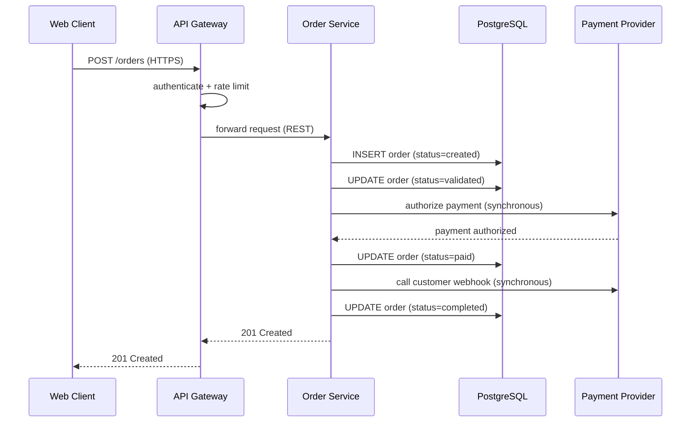
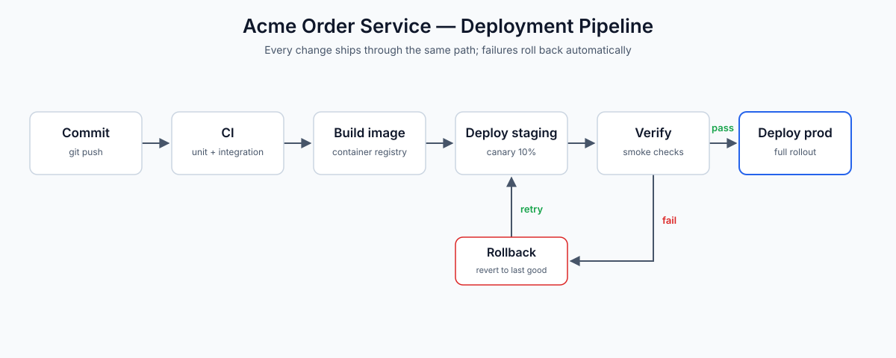

# Acme Order Service — Architecture (v1)

**Status:** Superseded by v2 · **Owner:** Platform Team · **Last reviewed:** 2026-06-15

!!! note "Version"
    You are reading the **previous (v1)** architecture. This revision
    predates the move to asynchronous event processing.
    [View v2 (current)](architecture.md)

> This is the original design of the Acme Order Service. It was superseded by
> [v2](architecture.md), which introduces the message queue and worker for
> asynchronous payment and webhook processing. The differences are called out
> in the **What changed in v2** section at the end.

## Overview

The Acme Order Service is a backend service that owns the order lifecycle for
the Acme storefront: creating orders, validating them, capturing payment,
tracking fulfillment, and notifying customers of status changes. It sits
between the customer-facing web client and the data stores, and it is the
single source of truth for order state.

In this (v1) design the order lifecycle is handled **synchronously**: a single
request path runs the whole flow — validation, payment authorization,
fulfillment, and customer webhooks — before responding to the client.

## System Architecture


### Component inventory

| Component     | Technology    | Responsibility                        |
| ------------- | ------------- | ------------------------------------- |
| Web client    | React SPA     | Customer-facing storefront            |
| API gateway   | Envoy         | Auth, routing, rate limiting, TLS     |
| Order service | Go (HTTP)     | Order lifecycle API; persists orders  |
| PostgreSQL    | PostgreSQL 16 | System of record for orders, payments |
| Redis         | Redis 7       | Session store, hot order cache        |

### Component notes

- **Web client.** A React single-page app running in the browser. It is the
  only component that talks to the API gateway directly; all traffic is HTTPS.
- **API gateway.** Terminates TLS, authenticates requests, enforces rate
  limits, and routes to the order service. It is intentionally thin: no
  business logic lives here.
- **Order service.** A stateless Go service that owns the order lifecycle. It
  validates incoming orders, persists them to PostgreSQL, authorizes payment
  with the payment provider, and calls customer webhooks — all within the
  request.
- **PostgreSQL.** The system of record. Every order state transition is a row
  update, so the database is the source of truth for order status.
- **Redis.** Caches hot order lookups and holds session data.

### Service configuration

```yaml
service:
  name: order-service
  env: production
  replicas: 4
  port: 8080

database:
  host: orders-db.internal
  port: 5432
  database: orders
  pool_size: 20
  statement_timeout_ms: 5000

cache:
  host: orders-cache.internal
  port: 6379
  session_ttl_seconds: 3600
  order_cache_ttl_seconds: 300

payment:
  provider: acme-payments
  timeout_ms: 5000
  retries: 2

webhooks:
  timeout_ms: 3000
  max_retries: 3
```

## Data Flow

### Order lifecycle

An order moves through five states: `created` → `validated` → `paid` →
`fulfilled` → `completed`, with `cancelled` reachable from `created` or
`validated`. In v1 the whole lifecycle runs inside a single request:



A few properties follow from this flow:

- The customer waits for the **entire** lifecycle (payment + webhook) before
  getting a response, so `POST /orders` is slow and its latency is bounded by
  the slowest third-party call.
- A payment-provider or webhook outage directly fails order placement.
- Retries are limited to the HTTP request itself; there is no durable
  requeue for the slow work.

### Deployment

Every change ships through the same pipeline, shown below. Failures at the
verification stage roll back automatically; there is no manual promotion step.



The pipeline stages are:

1. **Commit** — a change lands on `main` via a reviewed pull request.
2. **CI** — unit and integration tests run against the change.
3. **Build image** — a container image is built and pushed to the registry.
4. **Deploy staging** — the image is deployed to staging as a 10% canary.
5. **Verify** — smoke checks run against the canary.
6. **Deploy prod** — on a pass, the image rolls out to production. On a fail,
   the pipeline rolls back to the last good image.

## Design Decisions

### ADR-001: Stateless order service behind a thin gateway

**Context.** The order service handles bursty traffic and must scale quickly
without losing in-flight requests.

**Decision.** The order service is stateless: all state lives in PostgreSQL,
and session data lives in Redis. The API gateway is kept thin so that scaling
the service is a matter of adding replicas.

**Consequences.** Scaling is trivial and deploys are rolling, with no session
affinity.

### ADR-002: Synchronous payment and webhook handling

**Context.** Keeping the design simple was the priority for the first
revision; a single request path was easiest to reason about and operate.

**Decision.** Payment authorization and customer webhooks are called
synchronously within the `POST /orders` request.

**Consequences.** The request path is simple and there is no eventual
consistency. The cost is that order placement is slow and fragile: any
payment-provider or webhook outage fails the order, and there is no durable
retry for the slow work.

## What changed in v2

- **Asynchronous event path.** v2 adds a **message queue** (RabbitMQ) and a
  **worker** so that payment, fulfillment, and webhooks run out of band. The
  customer gets a `202 Accepted` as soon as the order row is written.
- **Durability and retries.** Slow work is retried independently with
  exponential backoff and a dead-letter queue, instead of failing the request.
- **Eventual consistency.** v2 trades the synchronous guarantee for fault
  isolation; the database remains the source of truth.

See the [current (v2) architecture](architecture.md) for the full details.
