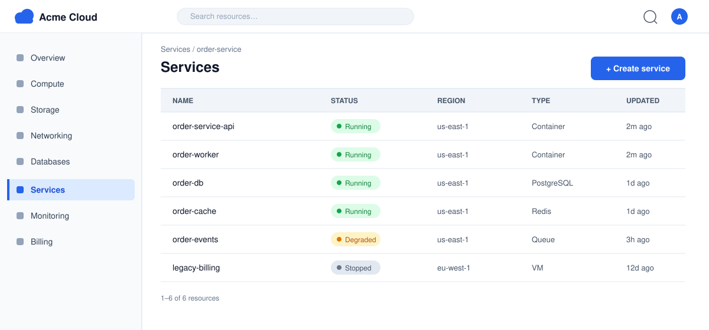
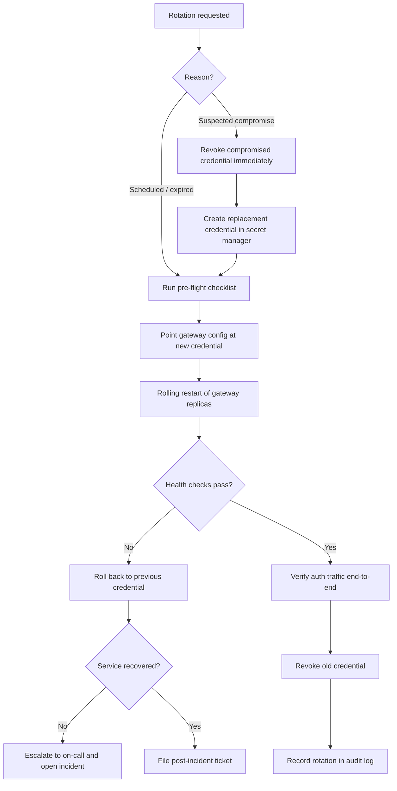

# Rotate API Gateway Database Credentials

**Status:** Active · **Owner:** Platform Team · **Last updated:** 2026-09-01

## Purpose

The API gateway authenticates every storefront request against a small
backing PostgreSQL database that stores API keys and client credentials.
The gateway's database credential is rotated quarterly and immediately on
any suspected compromise. This SOP describes how to rotate that
credential without dropping authenticated traffic.

## Scope

- **In scope:** the credential the API gateway uses to connect to its
  auth database (`gateway-auth-db`), and the gateway replicas that
  consume it.
- **Out of scope:** the order service's database credential
  (`orders-db`), the Redis session store, and the message queue. Each of
  those has its own rotation cadence and SOP.

## Prerequisites

- You have `rotate` permission on the `gateway-auth-db` credential in
  the secret manager.
- You can access the Acme Cloud console and the gateway's rollout
  controls.
- The rotation window is confirmed on the on-call calendar.

Before you start, complete the pre-flight checklist:

- [ ] Confirm no deployment is in flight on the gateway
- [ ] Verify the secret manager is reachable from the gateway network
- [ ] Snapshot the current gateway config for rollback reference
- [ ] Check the gateway error rate is at baseline (no open incidents)
- [ ] Announce the rotation window in the #ops channel

You will monitor the gateway from the console during the rotation:

*Figure 1: The Acme Cloud console Services page. The `order-service-api`
row is the API gateway; its status must remain **Running** throughout
the rotation.*

## Decision path

A scheduled rotation and a compromise-driven rotation diverge at the
first step: a compromise revokes the old credential before a replacement
is deployed, which means a brief window where the gateway cannot reach
its auth database.

## Procedure

1. **Generate the new credential.** In the secret manager, create a
   replacement credential for `gateway-auth-db` (role
   `gw_auth_reader_next`). Do not reuse the old password value.
2. **Grant access.** Grant the new role the same read-only grants as
   the old role on the auth database.
3. **Point the gateway at the new credential.** Update the gateway's
   config to reference the new secret path, and save the change.
4. **Rolling restart.** Trigger a rolling restart of the gateway
   replicas so each replica reconnects with the new credential.
5. **Watch the rollout.** Follow the rollout in the console (Figure 1)
   and confirm each replica reports **Running** before the next one is
   restarted.
6. **Verify.** Complete the verification checklist below.
7. **Revoke the old credential.** Once verification passes, revoke the
   old credential in the secret manager.

   > **Warning:** Revoking the old credential is the destructive step in
   > this procedure. If any replica is still using the old credential,
   > it loses access to the auth database and starts rejecting requests
   > with `500` errors. Only revoke after every replica has been
   > restarted with the new credential and the verification checklist
   > passes.

8. **Record the rotation.** Log the rotation (who, when, old and new
   credential IDs) in the audit log and close the pre-flight ticket.

## Verification

- [ ] All gateway replicas report **Running** in the console
- [ ] Gateway health endpoint returns `200` on every replica
- [ ] A test request with a valid API key returns `202 Accepted`
- [ ] A test request with an expired API key returns `401 Unauthorized`
- [ ] Gateway error rate is back to baseline within 15 minutes
- [ ] No new `auth-db connection refused` log entries since the rollout

## Rollback

If the gateway fails to come up with the new credential, or the error
rate spikes during the rollout:

1. Restore the previous config snapshot (step 3 in reverse) so the
   gateway references the old credential again.
2. Trigger a rolling restart of the gateway replicas.
3. Confirm the gateway is healthy and traffic is normal.
4. Leave the old credential active. Do not revoke it until the root
   cause is fixed and a fresh rotation succeeds.
5. File a ticket describing the failure, including the rollout logs and
   the time window of the error spike.

If the old credential was already revoked (step 7) before the failure
was noticed, the fastest recovery is to re-issue the old credential
value from the secret manager's audit history, deploy it, and then
investigate at lower urgency.
